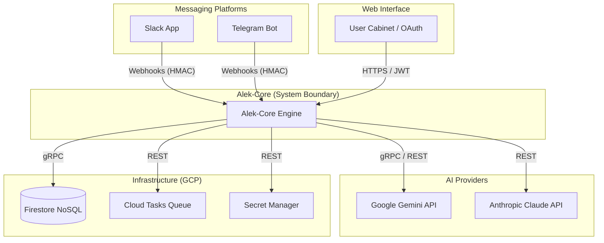

# 03 Context

## 1. System Context Diagram

Alek-Core sits at the center of a user's digital knowledge ecosystem, connecting messaging platforms with advanced AI reasoning and persistent memory.

---

## 2. External Systems & Personas

### 2.1 Personas (Users)

| Persona           | Description                                                       | Interaction Point                 |
| ----------------- | ----------------------------------------------------------------- | --------------------------------- |
| **End User**      | Individual seeking knowledge management and AI assistance.        | Slack, Telegram                   |
| **Account Owner** | Manages billing, team members (IAM), and shared account settings. | User Cabinet (Web UI)             |
| **System Admin**  | Manages global tokens, blueprints, and system-wide configuration. | Firestore Console / Admin Scripts |
| **AI Developer**  | Contributes to the codebase and maintains the architecture.       | GitHub / Cloud Build              |

### 2.2 External Systems

| System                 | Role                                                     | Protocol / Interface        |
| ---------------------- | -------------------------------------------------------- | --------------------------- |
| **Slack**              | Primary messaging platform for professional use.         | HTTPS Webhooks (Events API) |
| **Telegram**           | Secondary messaging platform for personal use.           | HTTPS Webhooks (Bot API)    |
| **Google OAuth**       | Identity provider for web authentication.                | OIDC / OAuth 2.0            |
| **Google Gemini**      | Primary LLM provider for reasoning and embeddings.       | REST / gRPC (Google SDK)    |
| **Anthropic Claude**   | Secondary LLM provider for high-performance reasoning.   | REST (Anthropic SDK)        |
| **Google Firestore**   | Primary database for facts, sessions, and configuration. | gRPC (Cloud SDK)            |
| **Google Cloud Tasks** | Background job queue for memory consolidation.           | REST (Cloud SDK)            |

---

## 3. Architectural Boundaries (Ports & Adapters)

Alek-Core follows **Hexagonal Architecture**, strictly separating the core logic from external technologies through Ports and Adapters.

### 3.1 Driving Adapters (Input)

These adapters receive requests from the outside world and translate them into domain-specific calls.

| Port / Interface  | Adapter Implementation   | Description                             |
| ----------------- | ------------------------ | --------------------------------------- |
| `ResponseChannel` | `SlackHTTPAdapter`       | Handles Slack Events API webhooks.      |
| `ResponseChannel` | `TelegramWebhookAdapter` | Handles Telegram Bot API webhooks.      |
| `Quart Blueprint` | `OAuth Web App`          | Handles web-based authentication flows. |
| `Quart Blueprint` | `User Cabinet App`       | Handles web-based user configuration.   |

### 3.2 Driven Adapters (Output)

These adapters are called by the core logic to interact with external systems.

| Port (Interface)    | Adapter Implementation       | External System            |
| ------------------- | ---------------------------- | -------------------------- |
| `LLMPort`        | `GeminiAdapter`              | Google Gemini API          |
| `LLMPort`        | `ClaudeAdapter`              | Anthropic Claude API       |
| `EmbeddingService`  | `GeminiEmbeddingAdapter`     | Google Gemini (Embeddings) |
| `FactRepository`    | `FirestoreFactRepository`    | Google Firestore           |
| `UserRepository`    | `FirestoreUserRepository`    | Google Firestore           |
| `AccountRepository` | `FirestoreAccountRepository` | Google Firestore           |
| `SessionStore`      | `FirestoreSessionStore`      | Google Firestore           |
| `TaskQueue`         | `CloudTasksQueue`            | Google Cloud Tasks         |
| `SecurityPort`      | `RegexSecurityAdapter`       | Internal (Regex Engine)    |
| `SecurityPort`      | `CompositeAdapter`           | Internal (Aggregation)     |

---

## 4. External Interfaces

### 4.1 Messaging Webhooks

Alek-Core exposes two primary webhook endpoints for messaging platforms:

- **Slack:** `/slack/events`
  - Security: HMAC-SHA256 signature verification using `SLACK_SIGNING_SECRET`.
  - Protocol: Slack Events API (JSON over HTTPS).
- **Telegram:** `/telegram/webhook`
  - Security: HMAC verification using `X-Telegram-Bot-Api-Secret-Token`.
  - Protocol: Telegram Bot API (JSON over HTTPS).

### 4.2 Web UI & OAuth

The web interface provides authentication and management capabilities:

- **OAuth Login:** `/auth/login`
  - Initiates Google OAuth 2.0 flow.
- **OAuth Callback:** `/auth/callback`
  - Handles OIDC token exchange and user registration.
- **User Cabinet:** `/cabinet`
  - Protected by JWT session tokens stored in secure cookies.

### 4.3 Background Processing

Alek-Core uses an asynchronous worker pattern for heavy tasks:

- **Worker Endpoint:** `/worker`
  - Triggered by Cloud Tasks to process enqueued Slack/Telegram events.
  - Enables "scale-to-zero" while maintaining responsiveness.

---

## 5. Data Flow (High-Level)

1. **Ingress:** A user sends a message via Slack or Telegram.
2. **Translation:** The platform adapter receives the webhook, verifies the signature, and translates the payload into a `MessageContext`.
3. **Authorization:** The `IAMService` checks if the user is authorized to interact with the bot.
4. **Orchestration:** The `ConversationHandler` (Application Layer) coordinates the multi-agent system.
5. **Reasoning:** Agents call the `LLMPort` (Port) to generate responses, which are fulfilled by the `GeminiAdapter` or `ClaudeAdapter`.
6. **Memory:** The `MemorySearchAgent` queries the `FactRepository` (Port) for relevant context.
7. **Egress:** The response is sent back to the user via the `ResponseChannel` (Port), implemented by the platform-specific adapter.
8. **Consolidation:** Periodically, conversation history is enqueued to `Cloud Tasks` for background synthesis into long-term facts.

---

**Last Updated:** 2026-02-10  
**Status:** ✅ Complete  
**Phase:** Documentation Audit Phase 1.3
