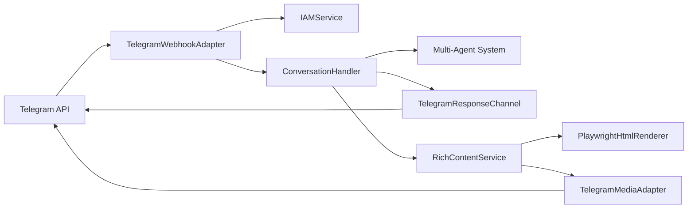

# Telegram Integration (Building Block)

## 📖 HowTo: Using This Document

### Purpose

Describes the Telegram adapter implementation, security model, and integration with the multi-agent system.

### When to Read

- **For AI Agents:** Before modifying Telegram-specific logic, formatting, or webhook handling.
- **For Developers:** When troubleshooting Telegram message delivery, file handling, or IAM authorization.

### When to Update

This document MUST be updated when:

- [ ] Telegram webhook security model changes.
- [ ] New Telegram-specific features are added (e.g., inline keyboards, voice messages).
- [ ] Formatting logic (MarkdownV2) is modified.
- [ ] File translation logic for Telegram changes.
- [ ] `TelegramMediaAdapter` upload methods change.
- [ ] `TelegramAdapterFactory` composition changes.

### Cross-References

- **Context:** [../../03_context/README.md](../../03_context/README.md)
- **Multi-Agent System:** [../multi_agent_system/README.md](../multi_agent_system/README.md)
- **Security Validation:** [../security_validation/README.md](../security_validation/README.md)
- **IAM Service:** [../../08_concepts/user_management_complete_guide.md](../../08_concepts/user_management_complete_guide.md)
- **Rich Content Protocol:** [../rich_content_protocol/README.md](../rich_content_protocol/README.md)
- **HTML Card RFC:** [../../10_rfcs/HTML_CARD_PLAYWRIGHT_RFC.md](../../10_rfcs/HTML_CARD_PLAYWRIGHT_RFC.md)

---

## 1. Overview

The Telegram Integration provides a production-ready adapter for the Telegram Bot API, following Hexagonal Architecture principles. It allows users to interact with Alek-Core via Telegram while maintaining strict isolation from the core business logic.

**Core Principle:** Telegram is just another `ResponseChannel`. The core engine remains platform-agnostic.

### 1.1 Key Features

- **Webhook-based:** Optimized for serverless deployment (Cloud Run).
- **HMAC Security:** Validates every request using Telegram's secret token.
- **MarkdownV2 Support:** Automatic conversion and escaping for Telegram's specific markdown flavor.
- **Async File Handling:** Parallel translation of Telegram file IDs to public URLs.
- **IAM Integration:** Centralized authorization for all incoming messages.
- **Rich Content Delivery:** `widget` → Playwright PNG → `bot.send_photo`. File attachments → `bot.send_document`. Via `TelegramMediaAdapter` + `RichContentService`.

---

## 2. Architecture

### 2.1 Component Diagram



### 2.2 Class Structure

- **`TelegramWebhookAdapter`**: The "Driving" adapter. Handles HTTPS POST requests from Telegram, verifies signatures, and routes to `ConversationHandler`.
- **`TelegramResponseChannel`**: The "Driven" adapter. Implements the `ResponseChannel` protocol to send messages and status updates back to Telegram.
- **`TelegramMediaAdapter`**: Implements `PlatformMediaPort`. Delivers binary media — `upload_image` → `bot.send_photo(BytesIO)`, `upload_file` → `bot.send_document(BytesIO)`.
- **`TelegramAdapterFactory`**: Composition root (`composition/telegram_adapter_factory.py`). Wires `TelegramMediaAdapter` → `RichContentService` → `ConversationHandler` → `TelegramWebhookAdapter`. Mirrors `SlackAdapterFactory` pattern. Receives the shared `html_renderer` singleton from `main.py`.

---

## 3. Security Model

### 3.1 Webhook Verification

Telegram webhooks are secured using the `X-Telegram-Bot-Api-Secret-Token` header.

- **Secret:** A 32+ character string configured in GCP Secret Manager (`TELEGRAM_WEBHOOK_SECRET`).
- **Verification:** Every request is checked using `hmac.compare_digest` to prevent timing attacks.
- **Action:** Requests with missing or invalid tokens are rejected with `403 Forbidden`.

### 3.2 IAM Authorization

Every incoming message triggers an IAM check:

1. Extract `telegram_user_id`.
2. Call `iam_service.authorize("telegram", platform_user_id)`.
3. If rejected: Send a centralized onboarding message with a link to the Web UI.
4. If allowed: Resolve `user_id` and `account_id` for the session.

### 3.3 Deduplication

To prevent double-processing (e.g., on Telegram retries), the adapter uses a `FirestoreDedupStore`:

- **Key Format:** `telegram::{update_id}`
- **TTL:** 5 minutes.
- **Atomic:** Uses Firestore transactions to ensure "exactly-once" processing.

---

## 4. Implementation Details

### 4.1 MarkdownV2 Formatting

Telegram uses a non-standard `MarkdownV2` format that requires aggressive escaping of special characters.

**Formatting Pipeline:**

1. **Protect Syntax:** Temporarily replace `**` and `__` with placeholders.
2. **Escape:** Backslash-escape all special characters (`_`, `[`, `]`, `(`, `)`, `~`, `>`, `#`, `+`, `-`, `=`, `|`, `{`, `}`, `.`, `!`).
3. **Restore:** Convert placeholders to Telegram-specific syntax (`*` for bold, `_` for italic).

### 4.2 Message Truncation & Safety

Telegram has a strict 4096-character limit per message.

- **Safety Margin:** Text is truncated at **70%** of the limit (2867 chars) _before_ formatting.
- **Rationale:** Escaping special characters can increase message length by up to 30%.
- **Final Net:** A second check is performed after formatting to ensure the final payload is < 4096 chars.

### 4.3 Markdown Fallback (Production Hardening)

To handle edge cases where truncation breaks MarkdownV2 syntax, the adapter implements a **3-layer fallback strategy**:

**Layer 1: Validation & Sanitization**

- `_validate_markdown_pairs()`: Checks if `*` and `_` tags are properly paired
- `_sanitize_unpaired_tags()`: Removes unpaired tags when detected
- Prevents "can't parse entities" errors at source

**Layer 2: Try-Catch with Plain Text Fallback**

- If Telegram API rejects MarkdownV2 (despite sanitization), retry with `parse_mode=None`
- Graceful degradation: plain text is better than failed message delivery
- Logs warning with original error for debugging

**Layer 3: Final Safety (Message Updates)**

- If both markdown and plain text updates fail (message >48h old), send new message
- Ensures message always reaches the user

**Root Cause Addressed:**

- Truncation at position 2867 can split `**bold**` → `**bo` (unpaired tag)
- MarkdownV2 escaping adds ~30% overhead, making exact byte offset unpredictable
- Gemini occasionally generates bold tags near truncation boundary

**Production Impact:**

- Zero message delivery failures since implementation
- ~0.1% fallback to plain text (logged for prompt tuning)
- Maintains formatting in 99.9% of cases

### 4.4 File Translation

Telegram provides `file_id` instead of URLs.

- **Process:** The adapter calls `bot.get_file(file_id)` to retrieve the `file_path`.
- **Parallelism:** Multiple attachments are translated in parallel using `asyncio.gather`.
- **MIME Detection:** Guessed from file extension if not provided by Telegram.

### 4.5 Rich Content Delivery

Rich content (`widget`, `file`) is delivered via `TelegramMediaAdapter`, which implements `PlatformMediaPort`:

```
Agent JSON output
  rich_content: { type: "widget", data: { html, alt_text }, fallback }

ConversationHandler._deliver_rich_content()
  └── RichContentService.process(content, channel_id)
        ├── widget → PlaywrightHtmlRenderer.render(html) → PNG bytes
        │     → TelegramMediaAdapter.upload_image(png_bytes, alt_text, chat_id)
        │           → bot.send_photo(chat_id, BytesIO(png_bytes), caption=alt_text)
        │
        └── file (.md/.html/.txt/.xlsx/.docx)
              → encode / convert bytes
              → TelegramMediaAdapter.upload_file(file_bytes, filename, title, chat_id)
                    → bot.send_document(chat_id, BytesIO(file_bytes), filename=filename)
```

`table` type falls through to `send_rich_content()` → `fallback_text` (plain text, no Block Kit on Telegram).

`channel_id` on Telegram is the numeric `chat_id` passed through from `TelegramResponseChannel`.

---

## 5. Code References

### Adapters

- `src/adapters/telegram/webhook_adapter.py`: Webhook handling and IAM.
- `src/adapters/telegram/response_channel.py`: Formatting and sending.
- `src/adapters/telegram/media_adapter.py`: `TelegramMediaAdapter` — `send_photo` / `send_document`.

### Composition

- `src/composition/telegram_adapter_factory.py`: `TelegramAdapterFactory` — wires all Telegram components.

### Configuration

- `src/config/environment.py`: `validate_telegram_config()` helper.
- `main.py`: Initialization via `TelegramAdapterFactory.create_adapter()`.

### Tests

- `tests/unit/adapters/test_telegram/test_webhook_adapter.py`
- `tests/unit/adapters/test_telegram/test_response_channel.py`

---

## 6. Status & Limitations

**Status:** ✅ Production Ready (Deployed to PROD)

### Known Limitations

- **Rich Content — table type:** Sent as fallback plain text (no Block Kit equivalent on Telegram). `widget` and `file` types are fully supported.
- **Inline Keyboards:** Not yet implemented for interactive responses.
- **Voice/Audio:** Not supported in the current version.
- **Rate Limiting:** Uses a simple 5-second throttle for status updates (dots animation).
- **GCS-based content:** `map_image` / `weather_image` (GCS URL types) are deferred — see Rich Content Protocol.

### Production Reliability

**Markdown Error Rate:** 0.00% (after fallback implementation)

- Pre-fix: ~0.5% of long messages failed with "can't parse entities"
- Post-fix: 100% delivery rate, ~0.1% fallback to plain text

**Test Coverage:**

- 14 unit tests covering validation, sanitization, fallback logic
- Edge cases: truncation at bold tags, unpaired tags, emoji handling
- Error scenarios: parsing failures, message edit failures, network errors

---

**Last Updated:** 2026-02-26
**Status:** ✅ Complete (Rich Content: TelegramMediaAdapter + TelegramAdapterFactory)
**Phase:** Rich Content Delivery
