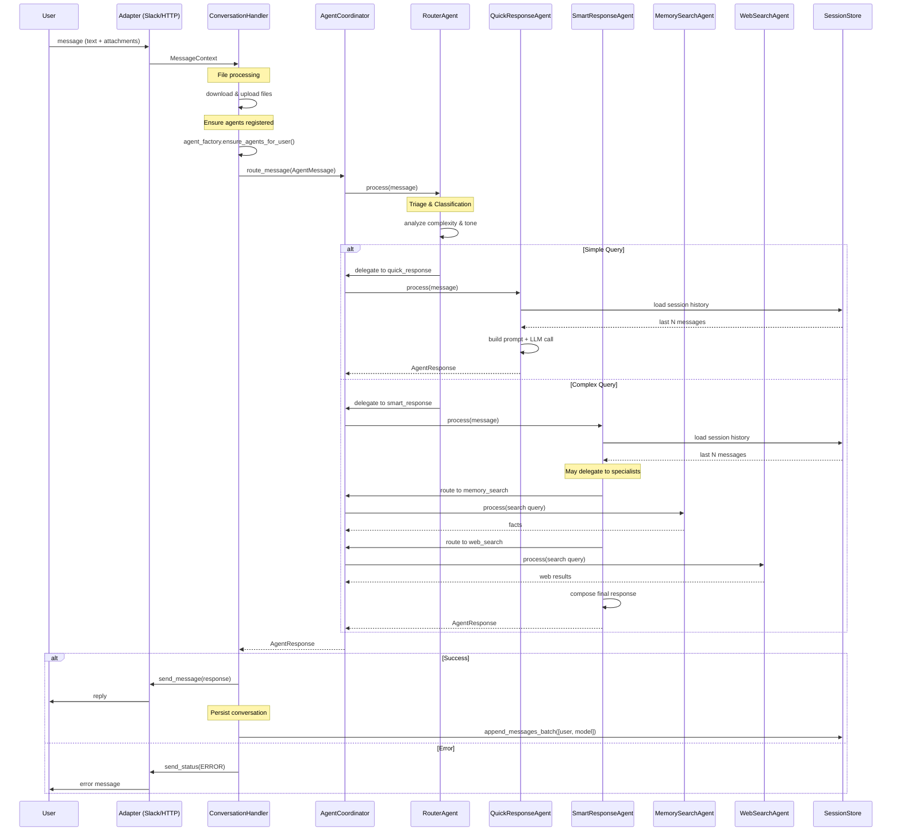
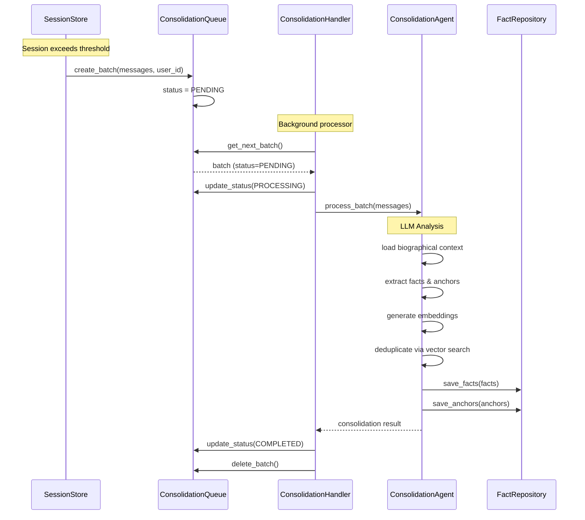

# 06 Runtime View

## 📖 HowTo: Using This Document

### Purpose
Describes runtime behavior: message flow, agent coordination, session lifecycle, and consolidation process.

### When to Read
- **For AI Agents:** Before changing runtime orchestration or agent flows.
- **For Developers:** When debugging message processing or session lifecycle.

### When to Update
This document MUST be updated when:
- [ ] The message flow changes.
- [ ] Agent coordination logic changes.
- [ ] Session lifecycle rules are updated.
- [ ] New agents are added or removed from the coordination flow.

### Cross-References
- **Building Blocks:**
  - [Multi-Agent System](../05_building_blocks/multi_agent_system/README.md)
  - [Hybrid Router](../05_building_blocks/hybrid_router/README.md)
  - [Sliding Window Consolidation](../05_building_blocks/sliding_window_consolidation/README.md)
  - [Session Lifecycle (Sliding Window)](../05_building_blocks/sliding_window_consolidation/README.md#session-lifecycle)
- **Target Architecture:** [../04_solution_strategy/target_architecture/TARGET_ARCHITECTURE.md](../04_solution_strategy/target_architecture/TARGET_ARCHITECTURE.md)
- **Agent Communication Protocol:** [../05_building_blocks/multi_agent_system/README.md](../05_building_blocks/multi_agent_system/README.md)

---

## 📂 Contents

1. [Message Processing Flow](#1-message-processing-flow-v60)
2. [Agent Coordination Patterns](#2-agent-coordination-patterns)
3. [Session Lifecycle](#3-session-lifecycle)
4. [Consolidation Process](#4-consolidation-process)

---

## 1. Message Processing Flow (v6.0)

### 1.1 Overview

The system uses a **multi-agent architecture** with a central `AgentCoordinator` for routing. Messages flow through specialized agents, each with distinct responsibilities.

### 1.2 Sequence Diagram



### 1.3 Flow Details

#### Step 1: Adapter Layer
**Code:** `src/adapters/slack/`

- Receives platform-specific event (Slack message, HTTP request)
- Translates to platform-agnostic `MessageContext` DTO
- Includes: text, attachments, session_id, user_id, thread_id

#### Step 2: Conversation Handler
**Code:** `src/handlers/conversation_handler.py`

**Responsibilities:**
1. **File Processing:** Download attachments, upload to LLM-compatible format
2. **Agent Initialization:** Ensure user's agent instances exist (`UserAgentFactory`)
3. **Message Creation:** Create `AgentMessage` with intent=QUERY
4. **Routing:** Send message to `router_agent_{user_id}` via `AgentCoordinator`
5. **Response Handling:** Parse response, send to platform via `ResponseChannel`
6. **Session Persistence:** Batch write user + model messages to `SessionStore`

#### Step 3: Agent Coordinator
**Code:** `src/infrastructure/agent_coordinator.py`

**Routing Strategies:**
1. **Explicit Routing:** `recipient = specific_agent_id` → route directly
2. **Broadcast Routing:** `recipient = "broadcast"` → find agents by capability
3. **Fallback:** Return error if no route found

#### Step 4: Router Agent (Triage)
**Code:** `src/agents/core/router_agent.py`

**Classification Logic:**
- **LLM Triage (primary):** Uses Gemini with specialized prompt to analyze:
  - Complexity (1-10 scale)
  - Tone (casual/professional/technical/urgent)
  - Query type (simple/personal/external)
- **Rule-Based Fallback:** If LLM fails, use pattern matching
- **Decision:** Route to `quick_response` (complexity ≤5) or `smart_response` (complexity >5)

See: [Hybrid Router Building Block](../05_building_blocks/hybrid_router/README.md)

#### Step 5: Response Agents

**Quick Response Agent** (`src/agents/core/quick_response_agent.py`)
- Model: `gemini-2.0-flash` (fast, cheap)
- Use case: Simple queries, greetings, factual questions
- No tool access, no delegation

**Smart Response Agent** (`src/agents/core/smart_response_agent.py`)
- Model: `gemini-2.0-flash-thinking` (complex reasoning)
- Use case: Analysis, research, multi-step tasks
- **Can delegate** to specialist agents:
  - `memory_search_agent` → RAG from user's memory
  - `web_search_agent` → Gemini Grounding for external info

See: [Multi-Agent System Building Block](../05_building_blocks/multi_agent_system/README.md)

#### Step 6: Session Persistence
**Code:** `src/adapters/firestore_session_store.py`

- **Batch Write:** User + Model messages saved together (atomic)
- **Sliding Window:** Sessions limited to 200 messages (threshold), overflow moved to consolidation queue
- **TTL:** 90 days of inactivity

See: [Sliding Window Consolidation](../05_building_blocks/sliding_window_consolidation/README.md)

---

## 2. Agent Coordination Patterns

### 2.1 Agent Communication Protocol (ACP)

All agents communicate using standardized `AgentMessage` and `AgentResponse` structures.

**AgentMessage Structure:**
```python
{
    "task_id": "uuid",
    "sender": "conversation_handler",
    "recipient": "router_agent_{user_id}",
    "intent": "QUERY",  # QUERY, DELEGATE, INFORM, REQUEST_FEEDBACK
    "payload": {"text": "...", "attachments": [...]},
    "context": {"session_id": "...", "user_id": "...", "metadata": {...}},
    "timeout_ms": 30000
}
```

**AgentResponse Structure:**
```python
{
    "task_id": "uuid",
    "agent_id": "smart_response_agent_user123",
    "status": "SUCCESS",  # SUCCESS, PARTIAL, FAILED, TIMEOUT, CANNOT_HANDLE
    "result": {"text": "...", "structured_data": {...}},
    "confidence": 0.95,
    "metadata": {"model": "gemini-2.0-flash-thinking", "tokens": 1234}
}
```

See: `Agent Domain Models`

### 2.2 Routing Strategies

#### Explicit Routing
Used for direct agent-to-agent communication.

```python
message = AgentMessage.create(
    sender="smart_response_agent",
    recipient="memory_search_agent_user123",
    intent=AgentIntent.DELEGATE,
    payload={"query": "user's preferences"}
)
response = await coordinator.route_message(message)
```

#### Broadcast Routing
Used for capability-based discovery.

```python
message = AgentMessage.create(
    sender="smart_response_agent",
    recipient="broadcast",
    intent=AgentIntent.QUERY,
    payload={"capability": "web_search"}
)
responses = await coordinator.route_message(message)
```

#### Parallel Execution
Multiple agents can be called concurrently.

```python
# SmartResponseAgent can delegate to multiple specialists
memory_task = coordinator.route_message(memory_query)
web_task = coordinator.route_message(web_query)
memory_response, web_response = await asyncio.gather(memory_task, web_task)
```

### 2.3 Agent Resilience

All agents inherit from `BaseAgent` with built-in resilience patterns:

1. **Circuit Breaker:** Auto-disable after 3 consecutive failures, recovery after 5 minutes
2. **Retry Logic:** 2 attempts with exponential backoff
3. **Timeout Protection:** Per-agent configurable timeouts (10-60s)
4. **Health Monitoring:** Track success rate, latency, and error counts

See: `BaseAgent Implementation`

---

## 3. Session Lifecycle

### 3.1 Session Creation
- **Trigger:** First message from user in a specific thread
- **Session ID:** `{platform}_{user_id}_{thread_id}`
- **Initial State:** Empty message list, 90-day TTL

### 3.2 Active Session (Hot Path)
- **Read:** `SessionStore.get_session(session_id)` returns last 200 messages
- **Write:** `SessionStore.append_messages_batch()` adds new messages
- **Windowing:** If message count exceeds threshold (200), oldest messages moved to consolidation queue

### 3.3 Session Overflow (Sliding Window)
**Code:** `src/domain/session.py`

When session exceeds threshold:
1. Oldest N messages (batch_size=100) removed from session
2. Batch created in `ConsolidationQueue` with status=PENDING
3. Session continues with reduced message count

### 3.4 Session Expiration
- **TTL:** 90 days of inactivity (last_updated_at + 90 days)
- **Action:** Entire session moved to consolidation queue
- **Status:** Session marked as expired, no longer accessible

### 3.5 Session Cleanup
- **Post-Consolidation:** After successful consolidation, batches deleted from queue
- **Deduplication:** Facts extracted from batches checked against existing memory

See: [Sliding Window Consolidation Building Block](../05_building_blocks/sliding_window_consolidation/README.md)

---

## 4. Consolidation Process

### 4.1 Trigger Conditions
1. **Session Overflow:** Sliding window threshold exceeded (automatic)
2. **Session Expiration:** 90-day TTL reached (automatic)
3. **Manual Trigger:** User command `$consolidate` (future)

### 4.2 Consolidation Flow



### 4.3 Consolidation Agent

**Code:** `src/agents/consolidation_agent.py`

**Process:**
1. **Load Context:** Fetch user's biographical context (cached)
2. **Extract Knowledge:** LLM analyzes raw messages for facts/anchors
3. **Generate Embeddings:** Parallel embedding generation (`asyncio.gather`)
4. **Deduplicate:** Vector search to avoid duplicate facts (distance <0.15)
5. **Save:** Batch write to `FactRepository`

**Performance:**
- Batch size: 100 messages
- Processing time: ~20-35s (5-7x speedup from optimization)
- Timeout: 60s

**Prompt:** `src/agents/prompts/consolidation_v2.prompt`

See: [Sliding Window Consolidation](../05_building_blocks/sliding_window_consolidation/README.md)

---

## 5. Error Handling & Degradation

### 5.1 Agent Failures
- **Circuit Breaker:** Agent auto-disabled after 3 failures
- **Fallback:** `RouterAgent` uses rule-based routing if LLM triage fails
- **Error Response:** Agent returns `AgentStatus.FAILED` with error message

### 5.2 Session Store Failures
- **Retry Logic:** 2 attempts with exponential backoff
- **Graceful Degradation:** If session save fails, response still delivered to user
- **Manual Recovery:** Admin can reconstruct session from platform message history

### 5.3 LLM Provider Failures
- **Multi-Provider Support:** Tier-based fallback (ECO → BALANCED → PERFORMANCE)
- **Timeout Protection:** Per-request timeouts (30-60s)
- **Cost Circuit Breaker:** Auto-disable if daily quota exceeded

See: [Provider Resolution](../05_building_blocks/provider_resolution/README.md)

---

## 6. Performance Characteristics

### 6.1 Latency Targets
- **Quick Response:** <2s (p95)
- **Smart Response:** <5s (p95)
- **Specialist Agents:** <3s (p95)
- **Consolidation:** <60s (p95)

### 6.2 Throughput
- **Concurrent Users:** 100+ (Cloud Run auto-scaling)
- **Messages/Second:** 10-50 (per instance)
- **Session Writes:** Batched (2 writes per conversation turn)

### 6.3 Cost Optimization
- **Model Selection:** Flash for simple queries, Thinking for complex
- **Caching:** Biographical context cached (10ms reads)
- **Batching:** Session messages batched, embeddings parallelized

---

## 7. Observability

### 7.1 Tracing
All flows instrumented with OpenTelemetry:
- `conversation.agent_response` (end-to-end)
- `agent.process` (per-agent execution)
- `session_store.load` / `session_store.save`

### 7.2 Logging

**Local:** human-readable text to stdout + `alek_debug.log` (DEBUG level).

**Cloud Run:** structured JSON via `google-cloud-logging` `StructuredLogHandler`. Each log entry carries `severity`, `message`, and filterable labels: `user_id`, `session_id`, `event_id`, `trace_id`. Detected automatically via `K_SERVICE` env var set by Cloud Run.

Key log points:
- Message received (with character count)
- Agent routing decision
- Agent execution (status, confidence, latency)
- LLM request/response (model, token count, tool calls)
- Session persistence (batch size)

See: [Logging Guide](../07_deployment/LOGGING.md)

### 7.3 Metrics
- Agent success rate
- Agent latency (p50, p95, p99)
- Circuit breaker state
- Session overflow frequency

See: [Observability Strategy](../05_building_blocks/observability_strategy/README.md)

---

**Last Updated:** 2026-02-18
**Status:** ✅ Complete (v6.0 implementation documented)
