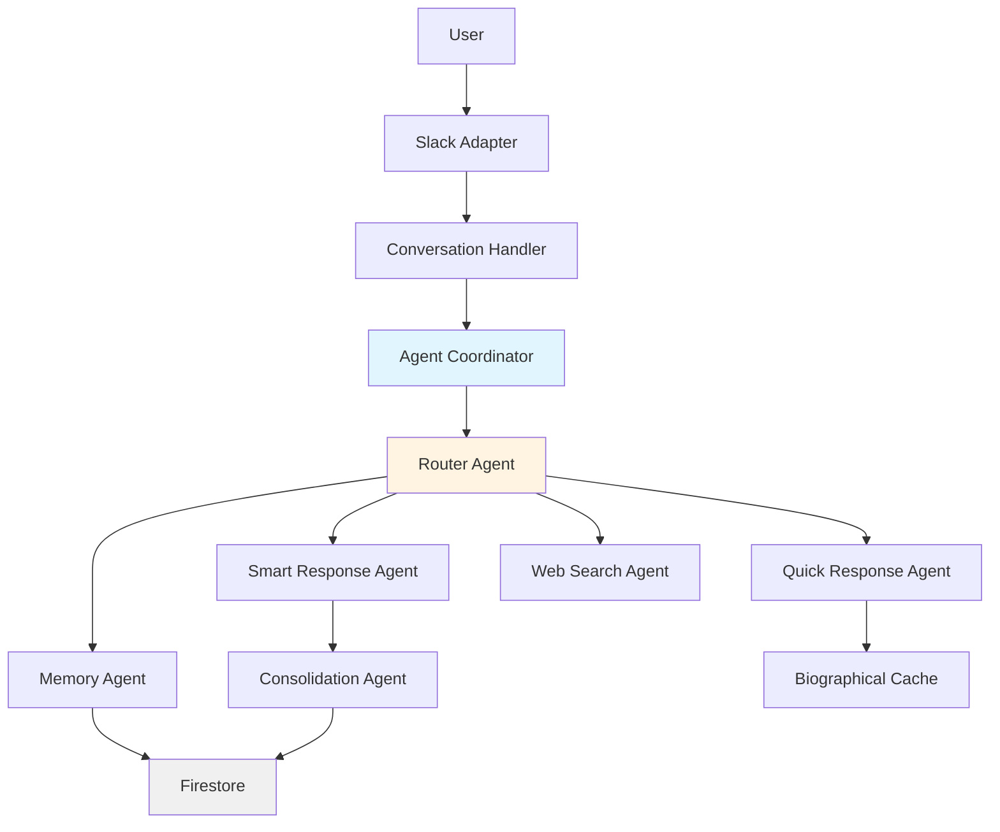

# Welcome to Alek-Core Documentation

**Alek-Core** is a Sovereign Exocortex (second brain) system built with:

- **Clean/Hexagonal Architecture** — Ports & Adapters pattern
- **Multi-Agent System** — 6 specialized agents with Actor Model
- **Cognitive Memory** — Sliding window consolidation for automatic memory extraction
- **Production-Ready** — Running on GCP with 85% cost optimization

---

## 🚀 Quick Start!

**New to the project?** Start here:

1. **[Essential Reading](ESSENTIAL_READING.md)** — Tiered onboarding guide (Tier 1-3)
2. **[Target Architecture](04_solution_strategy/target_architecture/TARGET_ARCHITECTURE.md)** — System blueprint (v6.0)
3. **[Installation Guide](guides/INSTALLATION.md)** — Local setup
4. **[Multi-Agent System](05_building_blocks/multi_agent_system/README.md)** — Core coordination pattern

---

## 📖 Documentation Structure

This knowledge base follows the **Arc42 architecture template**, adapted for hexagonal systems:

### 🏗️ Core Architecture (Arc42)

| Section                                                    | Purpose                           | Key Documents                                                                          |
| ---------------------------------------------------------- | --------------------------------- | -------------------------------------------------------------------------------------- |
| **[01 Introduction](01_introduction/README.md)**           | Project goals & stakeholders      | Requirements overview                                                                  |
| **[02 Constraints](02_constraints/README.md)**             | Technical & organizational limits | Technology choices                                                                     |
| **[03 Context](03_context/README.md)**                     | System boundaries & interfaces    | External dependencies                                                                  |
| **[04 Solution Strategy](04_solution_strategy/README.md)** | High-level approach               | [Target Architecture](04_solution_strategy/target_architecture/TARGET_ARCHITECTURE.md) |
| **[05 Building Blocks](05_building_blocks/README.md)**     | System components                 | 11 major building blocks                                                               |
| **[06 Runtime View](06_runtime/README.md)**                | Message flow & orchestration      | Agent coordination patterns                                                            |
| **[07 Deployment](07_deployment/README.md)**               | Infrastructure & operations       | GCP topology, CI/CD                                                                    |
| **[08 Concepts](08_concepts/README.md)**                   | Cross-cutting patterns            | Fractal architecture, best practices                                                   |
| **[09 Decisions](09_decisions/README.md)**                 | Architecture Decision Records     | 5 key ADRs                                                                             |
| **[10 RFCs](10_rfcs/README.md)**                           | Active proposals                  | 3 RFCs under discussion                                                                |
| **[11 Quality](11_quality/README.md)**                     | Testing & performance             | Quality attributes                                                                     |
| **[12 Risks](12_risks/README.md)**                         | Risk analysis & protocols         | Session continuity                                                                     |

### 🛠️ Operational Guides

Practical how-to documents for daily operations:

- **[Installation](guides/INSTALLATION.md)** — Dependencies & local setup
- **[Operations](guides/OPERATIONS.md)** — Memory management, deployment
- **[Slack Setup](guides/SLACK_SETUP.md)** — Socket Mode + HTTP Events
- **[Observability Logs](guides/OBSERVABILITY_LOGS_GUIDE.md)** — Tracing & debugging
- **[Prompt Components](guides/PROMPT_COMPONENTS_GUIDE.md)** — Groovy DSL examples

### 📋 Process & Management

Development process and planning:

- **[AI Development Culture](ai/AI_DEVELOPMENT_CULTURE.md)** — Protocols for AI-assisted development
- **[Implementation Roadmap](12_risks/IMPLEMENTATION_ROADMAP.md)** — Milestone tracking (v6.0 = 85% complete)

---

## 🎯 Current Status

**Architecture Version:** v6.0
**Milestone Progress:** Milestone 4 (Multi-Agent Integration) — 85% complete
**Documentation Migration:** Phase 5 (Final Cutover) — Complete

### Recent Achievements ✅

- Multi-agent system with 6 specialized agents
- Sliding window consolidation (automatic memory)
- Hybrid router (62% cost savings)
- Prompt component system (Groovy DSL)
- Arc42 documentation structure migration

### Next Steps 🎯

- Milestone 5: Advanced Patterns (parallel execution, consensus)
- Security hardening (prompt injection defense)
- Testing strategy implementation

---

## 🧭 Quick Navigation by Role

### For New Developers

1. [Essential Reading](ESSENTIAL_READING.md) (Tier 1)
2. [Target Architecture](04_solution_strategy/target_architecture/TARGET_ARCHITECTURE.md)
3. [Installation Guide](guides/INSTALLATION.md)
4. [Building Blocks Overview](05_building_blocks/README.md)

### For AI Agents

1. [AI Development Culture](ai/AI_DEVELOPMENT_CULTURE.md)
2. [Session Protocols](12_risks/session_protocols/SESSION_PROTOCOL_2026-01-30.md)
3. [Building Blocks Index](05_building_blocks/README.md)
4. [Migration Protocol](_project/migration/MIGRATION_AI_PROTOCOL.md)

### For System Architects

1. [Target Architecture](04_solution_strategy/target_architecture/TARGET_ARCHITECTURE.md)
2. [Architecture Decision Records](09_decisions/README.md)
3. [Concepts](08_concepts/README.md)
4. [Deployment Topology](07_deployment/README.md)

---

## 📊 Key Metrics

| Metric                   | Value | Description                                      |
| ------------------------ | ----- | ------------------------------------------------ |
| **Architecture Version** | v6.0  | Current system design                            |
| **Agents**               | 6     | Router, Quick, Smart, Memory, Web, Consolidation |
| **Cost Savings**         | 62%   | Hybrid routing optimization                      |
| **Memory Read Latency**  | 10ms  | Biographical context cache                       |
| **Monthly Cost**         | $65   | GCP infrastructure (production)                  |
| **Milestone Progress**   | 85%   | Milestone 4 completion                           |

---

## 🏗️ System Architecture Overview

---

## 📚 Documentation Standards

All documents follow these principles:

1. **HowTo Sections** — Every document includes usage instructions
2. **Cross-References** — Bidirectional links between related docs
3. **Code Verification** — All features verified against implementation
4. **Gap Tracking** — Discrepancies logged in [\_project/migration/FEATURE_GAP_ANALYSIS.md](_project/migration/FEATURE_GAP_ANALYSIS.md)
5. **Living Documentation** — Updated alongside code changes

See: [Documentation Guide](guides/DOCUMENTATION.md) for maintenance standards.

---

_Alek-Core: Toward a Sovereign Exocortex_
**Last Updated:** 2026-01-30
